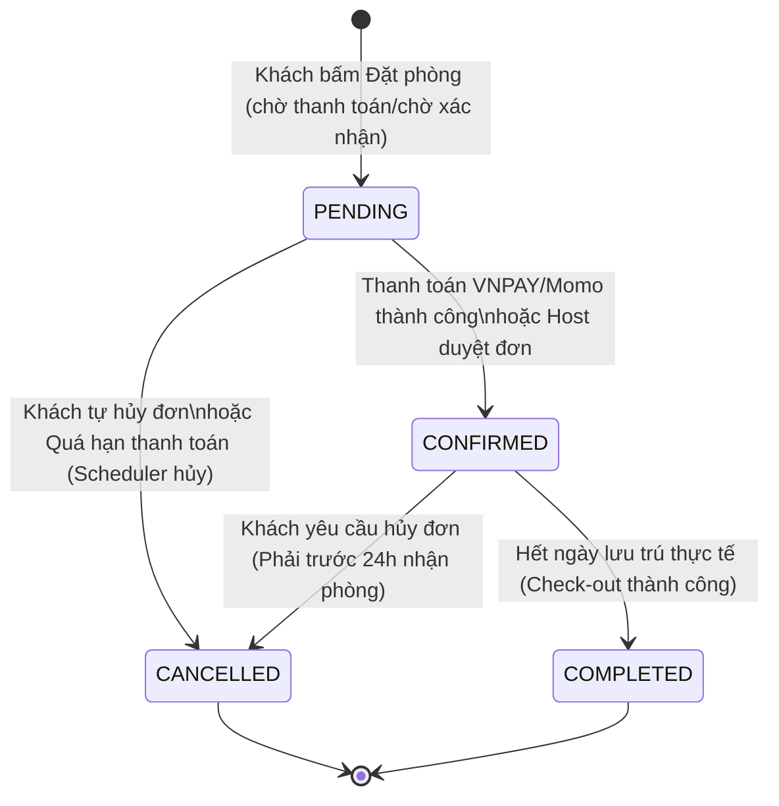

# CẨM NANG HƯỚNG DẪN TRẢ LỜI CÂU HỎI BẢO VỆ ĐỒ ÁN TỐT NGHIỆP
*(Đề tài: Hệ thống Đặt phòng Khách sạn - Hotel Booking)*

Tài liệu này hệ thống hóa các kiến thức cốt lõi, mã nguồn thực tế và kịch bản trả lời trước Hội đồng Đồ án tốt nghiệp (DATN) đối với **7 chủ đề** từ mức độ khẩn cấp cực cao đến thấp.

---

## 🔴 MỨC ĐỘ: RẤT CAO (DỄ BỊ HỎI SÂU & ĐÁNH GIÁ ĐIỂM GIỎI)

### 1. Pessimistic Lock chống Double Booking (Overbooking)

> [!IMPORTANT]
> **Vấn đề cốt lõi:** Khi nhiều khách hàng bấm đặt cùng một phòng vào cùng một khoảng thời gian tại cùng một mili-giây (Race Condition), hệ thống sẽ kiểm tra trạng thái phòng thấy còn trống và cho phép tạo nhiều đơn đặt phòng (Double Booking).

#### 1.1. Giải pháp kỹ thuật: Khóa bi quan (Pessimistic Write Lock)
Hệ thống sử dụng cơ chế **Pessimistic Lock (Khóa bi quan)** bằng cách thêm mệnh đề `FOR UPDATE` vào câu lệnh SQL truy vấn phòng/lịch phòng.
* **Cách thức hoạt động:** Khi Thread A gọi hàm đặt phòng, Spring Boot mở transaction và thực hiện câu lệnh `SELECT ... FOR UPDATE`. DB sẽ khóa bản ghi này lại. Thread B khi gọi cùng câu lệnh sẽ bị rơi vào trạng thái chờ (Blocked) cho đến khi Transaction của Thread A Commit hoặc Rollback (Giải phóng khóa).
* **So sánh với Optimistic Lock (Khóa lạc quan - dùng `@Version`):** Khóa lạc quan kiểm tra khi cập nhật dữ liệu. Nếu có xung đột sẽ throw `OptimisticLockException`. Trong nghiệp vụ đặt phòng, việc bắt người dùng click lại nhiều lần khi có tranh chấp hot-resource (phòng hot, giờ cao điểm) tạo trải nghiệm rất tệ. Khóa bi quan giúp xếp hàng (queue) yêu cầu ở tầng Database một cách an toàn.

#### 1.2. Minh họa Code Backend (Spring Boot JPA)
Trong `RoomRepository.java` hoặc `BookingRepository.java`, ta sử dụng annotation `@Lock`:
```java
@Repository
public interface RoomRepository extends JpaRepository<Room, Long> {

    @Lock(LockModeType.PESSIMISTIC_WRITE)
    @Query("SELECT r FROM Room r WHERE r.id = :id")
    Optional<Room> findByIdForUpdate(@Param("id") Long id);
}
```

**Luồng xử lý nghiệp vụ đặt phòng trong Service:**
```java
@Transactional
public BookingResponse createBooking(BookingRequest request) {
    // 1. Khóa bản ghi Room để độc chiếm quyền kiểm tra và cập nhật
    Room room = roomRepository.findByIdForUpdate(request.getRoomId())
            .orElseThrow(() -> new RuntimeException("Phòng không tồn tại"));

    // 2. Kiểm tra trùng lịch đặt phòng (Overlap check)
    boolean isOverlapping = bookingRepository.existsOverlappingBooking(
            room.getId(), request.getCheckIn(), request.getCheckOut());
    
    if (isOverlapping) {
        throw new RuntimeException("Phòng đã được đặt trong khoảng thời gian này!");
    }

    // 3. Tiến hành tạo đơn và lưu vào DB
    Booking booking = Booking.builder()
            .room(room)
            .checkIn(request.getCheckIn())
            .checkOut(request.getCheckOut())
            .status(Booking.Status.PENDING)
            .build();
            
    return toResponse(bookingRepository.save(booking));
} // Transaction kết thúc tại đây -> DB Commit -> Giải phóng khóa
```

#### 1.3. Kịch bản Test bằng JMeter (100 Threads)
* **Thiết lập:**
  * **Thread Group:** Number of Threads = 100, Ramp-up Period = 0 (tất cả 100 requests gửi đồng thời), Loop Count = 1.
  * **HTTP Request:** Gửi POST request tới `/api/bookings` với Payload chứa cùng `roomId`, `checkIn`, `checkOut`.
  * **HTTP Header Manager:** Thêm Authorization Token JWT.
* **Kết quả mong muốn:**
  * **Khi chưa dùng Lock:** 2 hoặc nhiều hơn đơn hàng tạo thành công (HTTP 200) cho cùng một phòng và ngày, DB xuất hiện lỗi toàn vẹn dữ liệu / trùng lịch.
  * **Khi có Pessimistic Lock:** Chỉ duy nhất **1 request thành công** (HTTP 200). **99 requests còn lại thất bại** (Trả về HTTP 400 hoặc 500 kèm Message: *"Phòng đã được đặt trong khoảng thời gian này!"*).

> [!TIP]
> **Mẫu câu trả lời trước Hội đồng:** 
> *"Thưa thầy cô, để giải quyết vấn đề tranh chấp phòng trống khi có hàng trăm khách hàng đặt cùng một phòng tại một thời điểm (Double Booking), em đã sử dụng cơ chế **Pessimistic Write Lock** thông qua annotation `@Lock(LockModeType.PESSIMISTIC_WRITE)` của JPA. Khi một luồng bắt đầu kiểm tra phòng, hệ thống sẽ thực hiện truy vấn `SELECT ... FOR UPDATE` để khóa bản ghi phòng đó lại ở tầng Database. Các luồng khác muốn truy cập bản ghi đó sẽ phải xếp hàng chờ cho đến khi transaction đầu tiên commit. Em đã kiểm thử giả lập trên **JMeter với 100 threads đồng thời** (Ramp-up = 0s) và kết quả là chỉ có đúng 1 giao dịch đặt phòng thành công, 99 giao dịch còn lại bị từ chối an toàn."*

---

### 2. VNPay Idempotency & Trả về Response Code 02 (IPN)

> [!IMPORTANT]
> **Vấn đề cốt lõi:** Khi người dùng thanh toán qua cổng VNPAY, VNPAY gửi kết quả về hệ thống qua 2 đường: **ReturnURL** (Redirect trình duyệt khách hàng) và **IPN URL** (Server-to-Server). Do mạng chập chờn hoặc cơ chế retry của VNPAY, IPN URL có thể bị gọi **nhiều lần** cho một giao dịch. Nếu không xử lý trùng lặp (Idempotency), hệ thống sẽ bị lỗi cập nhật trạng thái đơn nhiều lần, cộng tiền/hoa hồng nhiều lần.

#### 2.1. Phân biệt Return URL & IPN URL
* **Return URL (Client-side):** Client hoàn tất thanh toán ở cổng VNPAY -> VNPAY chuyển hướng trình duyệt về địa chỉ Frontend của ta. Phương thức này không đáng tin cậy vì người dùng có thể tắt trình duyệt đột ngột, mất mạng trước khi redirect thành công.
* **IPN URL (Server-side):** Server VNPAY gọi trực tiếp đến API Backend của ta một cách bất đồng bộ để thông báo kết quả. Rất đáng tin cậy. Nếu Backend của ta không phản hồi thành công, VNPAY sẽ gọi lại (retry) nhiều lần.

#### 2.2. Cơ chế xử lý Idempotency và mã lỗi `02`
Khi nhận được request IPN từ VNPAY, Backend phải thực hiện quy trình kiểm tra tuần tự:
1. **Kiểm tra chữ ký (Checksum):** Đảm bảo request đến từ VNPAY chứ không phải giả mạo.
2. **Kiểm tra đơn hàng tồn tại:** Mã đơn hàng `vnp_TxnRef` có trong DB của ta không.
3. **Kiểm tra số tiền (`vnp_Amount`):** Số tiền VNPAY gửi về có khớp với số tiền đơn hàng trong DB không.
4. **Kiểm tra trạng thái đơn hàng (Mấu chốt của Idempotency):**
   * Nếu đơn đặt phòng trong DB đang ở trạng thái `PENDING` (chờ xử lý) -> Tiến hành cập nhật đơn thành `CONFIRMED`, cập nhật Payment thành `SUCCESS` -> Trả về VNPAY: `{"RspCode": "00", "Message": "Confirm success"}`.
   * Nếu đơn đặt phòng trong DB đã được cập nhật thành `CONFIRMED` hoặc `CANCELLED` trước đó (do nhận được ReturnURL xử lý trước đó hoặc một IPN gửi trùng lặp trước đó) -> **Không cập nhật lại DB** -> Phản hồi ngay lập tức cho VNPAY mã **`02`**:
     ```json
     {
       "RspCode": "02",
       "Message": "Order already confirmed"
     }
     ```

#### 2.3. Cấu trúc Code xử lý IPN tại Controller
```java
@GetMapping("/vnpay-ipn")
public ResponseEntity<?> processVNPayIPN(@RequestParam Map<String, String> params) {
    // 1. Kiểm tra chữ ký bảo mật
    boolean isValidSignature = vnpayService.verifySignature(params);
    if (!isValidSignature) {
        return ResponseEntity.ok(Map.of("RspCode", "97", "Message", "Invalid Checksum"));
    }

    String bookingIdStr = params.get("vnp_TxnRef");
    Long bookingId = Long.parseLong(bookingIdStr);
    
    // 2. Tìm đơn hàng
    Optional<Booking> bookingOpt = bookingRepository.findById(bookingId);
    if (bookingOpt.isEmpty()) {
        return ResponseEntity.ok(Map.of("RspCode", "01", "Message", "Order not found"));
    }
    
    Booking booking = bookingOpt.get();
    
    // 3. Kiểm tra số tiền (VNPAY nhân tiền lên 100 lần)
    long vnpAmount = Long.parseLong(params.get("vnp_Amount")) / 100;
    if (booking.getTotalPrice().longValue() != vnpAmount) {
        return ResponseEntity.ok(Map.of("RspCode", "04", "Message", "Invalid Amount"));
    }

    // 4. Kiểm tra trạng thái đơn (Idempotency Check)
    if (booking.getStatus() != Booking.Status.PENDING) {
        // Đã cập nhật trước đó
        return ResponseEntity.ok(Map.of("RspCode", "02", "Message", "Order already confirmed"));
    }

    // 5. Cập nhật trạng thái nếu đơn hàng hợp lệ
    String responseCode = params.get("vnp_ResponseCode");
    if ("00".equals(responseCode)) {
        booking.setStatus(Booking.Status.CONFIRMED);
        paymentService.updatePaymentStatus(bookingId, Payment.Status.SUCCESS);
    } else {
        booking.setStatus(Booking.Status.CANCELLED);
        paymentService.updatePaymentStatus(bookingId, Payment.Status.FAILED);
    }
    bookingRepository.save(booking);

    return ResponseEntity.ok(Map.of("RspCode", "00", "Message", "Confirm success"));
}
```

> [!TIP]
> **Mẫu câu trả lời trước Hội đồng:**
> *"Thưa thầy cô, đối với tích hợp VNPAY, em sử dụng kênh **IPN (Instant Payment Notification)** là kênh giao tiếp trực tiếp server-to-server để cập nhật trạng thái đơn hàng nhằm tránh việc khách hàng tắt trình duyệt làm mất luồng cập nhật. Để chống việc VNPAY gửi trùng yêu cầu IPN (gây ra cập nhật DB nhiều lần), em đã áp dụng nguyên lý **Idempotency**. Khi nhận được request IPN, hệ thống sẽ kiểm tra trạng thái đơn hàng trong DB trước. Nếu trạng thái đơn hàng đã được cập nhật khác `PENDING` (ví dụ đã được confirm trước đó), hệ thống sẽ lập tức trả về mã lỗi **`RspCode: 02` (Order already confirmed)** để báo cho VNPAY biết yêu cầu này đã được xử lý xong, hệ thống sẽ không thực hiện thay đổi dữ liệu nào nữa."*

---

## 🟠 MỨC ĐỘ: CAO (CÂU HỎI THƯỜNG TRỰC VỀ LÝ THUYẾT & THỰC HÀNH)

### 3. Vấn đề N+1 Query & Xung đột JOIN FETCH với GROUP BY / Pagination

> [!WARNING]
> Bạn đã ghi nhận đây là "vấn đề gặp phải" trong tài liệu, Hội đồng chắc chắn sẽ yêu cầu bạn giải thích rõ bản chất lỗi và cách bạn đã xử lý nó.

#### 3.1. Bản chất lỗi N+1 Query
Xảy ra khi bạn truy vấn một danh sách đối tượng (ví dụ: Lấy danh sách 10 phòng), sau đó đối với mỗi phòng, JPA tự động sinh ra thêm 1 truy vấn phụ để tải thông tin liên kết Lazy loading (ví dụ: Lấy hình ảnh của phòng đó). Tổng cộng hệ thống thực hiện $1 + 10 = 11$ câu truy vấn SQL gây chậm hệ thống nghiêm trọng.

#### 3.2. Giải pháp sửa đổi và xung đột
* **Sửa nhanh bằng `JOIN FETCH`:** Ta thay đổi câu query thành `SELECT r FROM Room r JOIN FETCH r.images`. JPA sẽ gộp lại thành 1 câu truy vấn SQL JOIN duy nhất để lấy cả phòng và hình ảnh.
* **Xung đột 1: Phân trang (Pagination) bị lỗi bộ nhớ**
  * Khi dùng `JOIN FETCH` với quan hệ One-to-Many (Một phòng có nhiều hình ảnh), SQL trả về dạng tích Descartes (nếu phòng có 3 ảnh thì SQL trả về 3 dòng lặp lại thông tin phòng).
  * Nếu ta truyền thêm `Pageable` vào Spring Data, Hibernate sẽ không thể áp dụng `LIMIT` và `OFFSET` ở tầng DB được vì số dòng bị nhân lên. Kết quả là Hibernate sẽ tải **toàn bộ dữ liệu** lên RAM và thực hiện phân trang trong bộ nhớ (In-memory pagination), xuất hiện cảnh báo `HHH000104: firstResult/maxResults specified with collection fetch; applying in memory!`. Nếu DB có hàng ngàn dòng, server sẽ bị tràn bộ nhớ (Out Of Memory).
* **Xung đột 2: GROUP BY (Aggregate function)**
  * Khi ta muốn lấy danh sách phòng kèm điểm đánh giá trung bình (`AVG(review.rating)`) và dùng `JOIN FETCH` với hình ảnh. Việc kết hợp cả JOIN ảnh và JOIN đánh giá trong cùng một câu query tạo ra tích Descartes kép, làm sai lệch kết quả tính trung bình `AVG` (do số dòng đánh giá bị nhân bản tương ứng với số ảnh).

#### 3.3. Giải pháp tối ưu đã triển khai (2-Step Query)
Để giải quyết triệt để hai xung đột trên, trong file RoomService.java, em đã tách quá trình xử lý ra làm **2 truy vấn độc lập**:

```java
// BƯỚC 1: Lấy danh sách phòng kèm điểm đánh giá trung bình (GROUP BY hoạt động chính xác)
List<Object[]> rows = roomRepository.findByHostIdWithRating(host.getId());

// BƯỚC 2: Gom danh sách ID phòng lại, dùng 1 câu truy vấn với mệnh đề IN để lấy toàn bộ ảnh
List<Room> rooms = rows.stream().map(r -> (Room) r[0]).toList();
Map<Long, List<String>> imageMap = buildImageMap(rooms);
```

Hàm `buildImageMap(rooms)` thực hiện lấy tất cả ảnh trong một câu truy vấn duy nhất (Tránh N+1):
```java
private Map<Long, List<String>> buildImageMap(List<Room> rooms) {
    List<Long> roomIds = rooms.stream().map(Room::getId).toList();
    if (roomIds.isEmpty()) return Map.of();
    
    // SELECT img FROM RoomImage img WHERE img.room.id IN (:roomIds)
    List<RoomImage> images = roomImageRepository.findByRoomIdIn(roomIds);
    
    // Group các ảnh theo ID phòng nghỉ bằng Stream API
    return images.stream().collect(Collectors.groupingBy(
            img -> img.getRoom().getId(),
            Collectors.mapping(RoomImage::getUrl, Collectors.toList())
    ));
}
```
* **Kết quả:** Hệ thống chỉ chạy **đúng 2 câu lệnh SQL** thay vì $N+1$ câu lệnh, mà vẫn đảm bảo tính toán aggregate (AVG rating) chính xác và không bị cảnh báo phân trang bộ nhớ của Hibernate.

> [!TIP]
> **Mẫu câu trả lời trước Hội đồng:**
> *"Thưa thầy cô, lỗi N+1 Query xảy ra khi ta lấy danh sách thực thể cha nhưng Hibernate lại phải chạy thêm N câu truy vấn phụ để lấy danh sách thực thể con (Lazy loading). Để khắc phục, ta có thể dùng `JOIN FETCH`. Tuy nhiên, `JOIN FETCH` với quan hệ One-to-Many sẽ bị xung đột khi ta cần **Phân trang (Pagination)** hoặc **GROUP BY** tính toán trung bình (như tính trung bình rating của phòng). Nếu phân trang, Hibernate sẽ kéo toàn bộ dữ liệu vào RAM để phân trang thủ công gây nguy cơ tràn bộ nhớ.
> Để xử lý triệt để, em sử dụng giải pháp **Truy vấn 2 bước**: Bước 1, em chỉ truy vấn danh sách Room cùng rating trung bình bằng GROUP BY (hỗ trợ phân trang an toàn dưới DB). Bước 2, em gom toàn bộ Room ID lại và gọi 1 câu truy vấn thứ hai sử dụng mệnh đề `IN` để lấy danh sách hình ảnh tương ứng rồi gộp lại trong bộ nhớ. Cách này tối ưu hiệu năng và tránh được cả 2 lỗi trên."*

---

### 4. JWT + BCrypt + @PreAuthorize (Cơ chế Bảo mật cơ bản)

> [!IMPORTANT]
> **Vấn đề cốt lõi:** Hội đồng luôn hỏi về cách hệ thống xác thực người dùng, lưu mật khẩu và phân quyền truy cập API.

#### 4.1. Cơ chế xác thực không trạng thái (Stateless Authentication) bằng JWT
* **Luồng chạy:**
  1. Người dùng gửi Username/Password lên API `/api/auth/login`.
  2. Backend kiểm tra tính chính xác của mật khẩu.
  3. Nếu đúng, Backend sinh ra một chuỗi mã hóa **JWT Token** chứa thông tin người dùng (Username, Roles) và thời hạn hết hạn (Expiration Time), ký bằng một khóa bí mật (Secret Key) ở Server rồi gửi về Client.
  4. Client lưu Token này (vào LocalStorage hoặc Cookie).
  5. Với mọi request tiếp theo lên API bảo mật, Client đính kèm token trong Header: `Authorization: Bearer <Token>`.
  6. Backend dùng Filter (`JwtAuthenticationFilter`) cấu hình trong Spring Security để chặn request, bóc tách token, verify chữ ký bằng Secret Key. Nếu hợp lệ, hệ thống đưa thông tin người dùng vào `SecurityContextHolder` để xử lý tiếp mà không cần truy vấn Database tìm user.
* **Cấu trúc JWT:** Gồm 3 phần phân tách bằng dấu chấm `.`:
  * **Header:** Chứa thuật toán mã hóa (ví dụ HS256) và loại token (JWT).
  * **Payload:** Chứa các Claims (thông tin cần truyền đi như User ID, Username, Roles, thời gian tạo, thời gian hết hạn).
  * **Signature:** Chữ ký số để kiểm tra tính toàn vẹn của dữ liệu: `HMACSHA256(base64UrlEncode(Header) + "." + base64UrlEncode(Payload), SecretKey)`.

#### 4.2. Mã hóa mật khẩu bằng BCrypt
* **Nguyên lý:** BCrypt là thuật toán băm mật khẩu một chiều (One-way hashing).
* **Tại sao an toàn hơn MD5/SHA256?**
  * BCrypt có cơ chế tích hợp **Salt ngẫu nhiên** (muối) tự động. Mỗi lần băm một mật khẩu (dù ký tự giống hệt nhau), kết quả chuỗi băm ra sẽ khác nhau hoàn toàn. Do đó kẻ tấn công không thể dùng bảng băm sẵn (Rainbow Table) để tra ngược mật khẩu.
  * BCrypt hỗ trợ tham số **Work Factor (Cost)** giúp tăng độ phức tạp tính toán theo thời gian, chống tấn công dò mật khẩu bằng phần cứng mạnh (Brute force).
* **So khớp mật khẩu:** Hàm `bcryptEncoder.matches(rawPassword, encodedPassword)` bóc tách muối từ chuỗi mã hóa cũ, áp dụng thuật toán băm lên mật khẩu thô rồi so sánh 2 chuỗi băm.

#### 4.3. Phân quyền API bằng `@PreAuthorize`
* **Cách thức:** Spring Security sử dụng cơ chế AOP (Aspect-Oriented Programming).
* Khi đặt `@PreAuthorize("hasRole('HOST')")` trên một phương thức, Spring sẽ tạo ra một Proxy bao bọc class đó. Khi có yêu cầu gọi hàm, Proxy sẽ chặn lại, lấy thông tin người dùng hiện tại từ `SecurityContextHolder` và đánh giá biểu thức SpEL (Spring Expression Language) bên trong `@PreAuthorize`.
* Nếu người dùng không có vai trò phù hợp, hệ thống tự động ném ra `AccessDeniedException` và trả về HTTP Status `403 Forbidden` về phía Client.

---

## 🟡 MỨC ĐỘ: TRUNG BÌNH (NGHIỆP VỤ ĐẶC THÙ ĐỀ TÀI)

### 5. State Machine Đơn hàng & Ràng buộc Overlap ngày đặt

#### 5.1. Sơ đồ trạng thái đơn đặt phòng (State Machine)
Trạng thái của `Booking` tuân theo vòng đời chặt chẽ để đảm bảo tính nhất quán dữ liệu thanh toán:



#### 5.2. Công thức toán học & SQL kiểm tra trùng lịch đặt phòng (Overlap Constraint)
* Giả sử ta muốn đặt phòng từ ngày $[S_{new}, E_{new}]$ (Check-in đến Check-out).
* Một đơn đặt phòng cũ đã tồn tại có khoảng thời gian lưu trú là $[S_{old}, E_{old}]$.
* **Điều kiện trùng lịch (Overlap) xảy ra khi và chỉ khi:**
  $$S_{new} < E_{old} \quad \text{AND} \quad E_{new} > S_{old}$$
* **Giải thích trực quan:** Khoảng thời gian mới bắt đầu trước khi khoảng cũ kết thúc, và khoảng mới kết thúc sau khi khoảng cũ bắt đầu.
* **Câu lệnh SQL kiểm tra trong JPA Repository:**
  ```sql
  SELECT COUNT(b) FROM Booking b 
  WHERE b.room.id = :roomId 
    AND b.status IN ('PENDING', 'CONFIRMED')
    AND b.checkIn < :checkOutDate 
    AND b.checkOut > :checkInDate
  ```
  *(Nếu kết quả trả về `> 0`, phòng đó đã bị trùng lịch, hệ thống sẽ từ chối tạo đơn).*

#### 5.3. Case thực tế: Tại sao Khách A đặt 16-17 nhưng Khách B vẫn đặt được 17-18?
* **Nghiệp vụ khách sạn thực tế:** Khách A trả phòng (Check-out) vào lúc **12:00 ngày 17**. Khách B nhận phòng (Check-in) vào lúc **14:00 ngày 17**. Khoảng thời gian trống 2 tiếng ở giữa dùng để dọn phòng. Do đó, hai đơn đặt này không hề bị trùng nhau.
* **Chứng minh bằng biểu thức logic:**
  - Đơn cũ (Khách A): $S_{old} = 16$, $E_{old} = 17$
  - Đơn mới (Khách B): $S_{new} = 17$, $E_{new} = 18$
  - Ráp vào biểu thức kiểm tra:
    $$S_{new} < E_{old} \implies 17 < 17 \implies \textbf{FALSE}$$
  - Vì phép so sánh đầu tiên là `FALSE` nên kết quả logic cuối cùng là `FALSE` (Không trùng lịch). Vì vậy, hệ thống hoàn toàn cho phép Khách B đặt ngày 17-18.

> [!TIP]
> **Mẫu câu trả lời trước Hội đồng:**
> *"Thưa thầy cô, trong nghiệp vụ khách sạn, ngày trả phòng của khách này có thể trùng với ngày nhận phòng của khách tiếp theo (Ví dụ khách cũ Check-out lúc 12h trưa ngày 17 và khách mới Check-in lúc 14h chiều ngày 17). 
> Vì thế, câu lệnh SQL kiểm tra trùng lịch đặt phòng của em sử dụng phép so sánh **nhỏ hơn nghiêm ngặt (`<` và `>`)** chứ không dùng dấu bằng (`<=` hay `>=`). Cụ thể, hệ thống so sánh `Ngày Check-in mới < Ngày Check-out cũ`. Với trường hợp khách đặt 16-17 và khách đặt 17-18, biểu thức `17 < 17` trả về false, nghĩa là không bị trùng lịch và hệ thống cho phép đặt bình thường."*

#### 5.4. Nghiệp vụ phản hồi đánh giá của Host (Host Review Reply)
* **Ý nghĩa thực tế:** Khi Khách hàng đánh giá phòng nghỉ (ví dụ đánh giá 1 sao vì phòng bẩn), Host cần có quyền phản hồi lại (Reply) để giải thích (ví dụ: *"Hôm đó hệ thống nước tòa nhà gặp sự cố đột xuất, chúng tôi đã hoàn tiền 50% cho khách..."*). Điều này giúp thông tin đa chiều, giữ uy tín cho Host và tăng tính chuyên nghiệp của hệ thống.
* **Hiện trạng hệ thống (Hạn chế & Hướng phát triển):**
  - **Hiện trạng:** Đồ án hiện tại mới chỉ giải quyết luồng đánh giá **1 chiều** từ Khách hàng đến Phòng nghỉ sau khi đơn đặt ở trạng thái `COMPLETED` để đảm bảo tính khách quan của phản hồi.
  - **Hạn chế:** Hệ thống chưa hỗ trợ tính năng cho phép Host viết phản hồi phản biện hoặc cảm ơn lời đánh giá của khách hàng.
  - **Hướng khắc phục trong tương lai:** Trong giai đoạn tiếp theo, em sẽ bổ sung trường `hostReply` (kiểu dữ liệu String) và `repliedAt` (kiểu dữ liệu LocalDateTime) vào thực thể `Review` ở database. Đồng thời, xây dựng giao diện viết phản hồi tại Dashboard của Host và hiển thị bình luận phản hồi này thụt lề ngay dưới đánh giá gốc ở trang Chi tiết phòng nghỉ.

> [!TIP]
> **Mẫu câu trả lời trước Hội đồng (Khi bị hỏi về tương tác 2 chiều hoặc hạn chế đánh giá):**
> *"Thưa thầy cô, đối với nghiệp vụ đánh giá phòng, hiện tại hệ thống của em mới chỉ hỗ trợ luồng đánh giá một chiều từ Khách hàng đến Phòng nghỉ sau khi đơn đặt ở trạng thái `COMPLETED` để đảm bảo tính khách quan của phản hồi.
> Em nhận thấy việc thiếu tính năng cho phép Host phản hồi lại đánh giá của khách là một hạn chế nhỏ về mặt tương tác. Hướng phát triển tiếp theo của em là bổ sung thêm trường `hostReply` vào thực thể `Review` và xây dựng màn hình nhập phản hồi cho Host để giúp xử lý các phản ánh tiêu cực của khách hàng một cách công bằng và minh bạch hơn ạ."*

---


### 6. Luồng Công Nợ Chủ Phòng (Host Revenue Flow)

> [!NOTE]
> Nghiệp vụ tài chính trong đồ án cần được mô tả mạch lạc và minh bạch để thuyết phục Hội đồng rằng hệ thống có tính thực tế.

#### 6.1. Quy trình xử lý dòng tiền
1. **Khách hàng thanh toán trực tuyến:** Tiền thanh toán của khách qua VNPAY/Momo được chuyển trực tiếp vào tài khoản ngân hàng của **Hệ thống (tài khoản doanh nghiệp của Admin)**. Trạng thái đơn hàng chuyển sang `CONFIRMED`.
2. **Trích xuất hoa hồng (Commission Fee):** Hệ thống áp dụng phí hoa hồng cố định (ví dụ **`10%`** tổng giá trị đơn đặt phòng).
   $$\text{Doanh thu thực nhận của Host} = \text{Tổng tiền đơn đặt} \times (1 - 10\%)$$
3. **Chu kỳ đối soát (Payout Cycle):** 
   * Dòng tiền không chuyển ngay cho Host để phòng trường hợp khách hủy phòng hoặc xảy ra tranh chấp dịch vụ.
   * Định kỳ vào **ngày cuối cùng của tháng** (hoặc ngày 1 đầu tháng sau), Admin thực hiện chức năng đối soát tự động. Hệ thống quét tất cả các đơn đặt phòng có trạng thái `COMPLETED` trong tháng của từng Host, tính tổng số tiền thực nhận sau khi trừ hoa hồng hệ thống.
   * Admin thực hiện chuyển khoản tự động hoặc duyệt lệnh rút tiền (Payout Request) của Host về tài khoản ngân hàng mà Host đã liên kết trên hệ thống.

#### 6.2. Các con số nghiệp vụ cần nhớ
* **Phí hoa hồng hệ thống:** `10%` (hoặc con số bạn cấu hình trong file properties).
* **Thời gian đối soát:** Cuối mỗi tháng.
* **Trạng thái đơn hàng được đối soát:** Chỉ tính các đơn đã hoàn thành (`COMPLETED`). Đơn hủy (`CANCELLED`) không được tính doanh thu (nếu đơn hủy được hoàn tiền) hoặc xử lý phạt hủy phòng tùy chính sách.

#### 6.3. Rủi ro bùng phòng khi thanh toán tiền mặt trực tiếp (CASH) và giải pháp
* **Vấn đề rủi ro nghiệp vụ:** Khi khách đặt phòng chọn thanh toán tiền mặt trực tiếp (CASH), hệ thống không giữ cọc hay thẻ tín dụng. Nếu khách hủy sát giờ hoặc không đến (No-Show), Host gánh chịu 100% thiệt hại vì phòng bị khóa vô ích, nền tảng không thể tự động thu phí phạt.
* **Đề xuất giải pháp khắc phục (Hướng phát triển/Cải tiến):**
  1. **Đặt cọc tối thiểu (Partial Deposit):** Dù chọn thanh toán tiền mặt tại quầy, khách hàng bắt buộc đặt cọc online trước **10% - 20%** qua ví điện tử/ngân hàng. Khoản này sẽ bị tịch thu làm phí đền bù cho Host nếu khách bùng phòng.
  2. **Xác nhận thủ công (Host Manual Confirm):** Đơn tiền mặt ở trạng thái `PENDING` (chờ xác nhận). Host gọi điện trực tiếp xác nhận, nếu liên lạc được mới bấm "Duyệt" (Confirm) trên Dashboard, nếu không liên lạc được sau 2 tiếng thì tự động hủy đơn giải phóng phòng.
  3. **Tín nhiệm tài khoản (Blacklist/Score):** Hệ thống theo dõi lịch sử bùng phòng. Nếu khách hàng bùng quá 2 lần, tài khoản sẽ bị blacklist (khóa tài khoản hoặc cấm sử dụng phương thức thanh toán tiền mặt).

> [!TIP]
> **Mẫu câu trả lời trước Hội đồng:**
> *"Thưa thầy cô, việc cho phép thanh toán tiền mặt trực tiếp (CASH) mà không có thẻ tín dụng liên kết hay đặt cọc online quả thực là một **rủi ro nghiệp vụ lớn cho Host** vì khách hàng có thể bùng phòng mà không chịu bất cứ ràng buộc tài chính nào. 
> Trong đồ án hiện tại, để giảm thiểu rủi ro này, em đã xây dựng luồng **Host xác nhận thủ công (Host Manual Approval)**. Khi khách đặt bằng tiền mặt, đơn hàng sẽ ở trạng thái `PENDING`, Host phải liên hệ bằng điện thoại xác thực trước khi duyệt đơn. Hướng phát triển trong tương lai của em là bắt buộc khách đặt cọc trước **10% đến 20%** qua ví điện tử/VNPAY kể cả khi chọn phương thức thanh toán tiền mặt, khoản cọc này dùng để đền bù phí phạt hủy cho Host nếu khách bùng phòng ạ."*

---

## 🟢 MỨC ĐỘ: THẤP HƠN (MÔ TẢ CÔNG NGHỆ, ÍT BỊ VẶN VẸO SÂU)

### 7. Chatbot, Giao diện & Kế hoạch Triển khai (Deployment)

#### 7.1. Chức năng Chatbot hỗ trợ khách hàng
* **Cách hoạt động:** Khi người dùng gửi câu hỏi ở khung chat, Frontend gửi request lên API `/api/chatbot`.
* **Xử lý Backend:**
  * **Giải pháp 1 (AI API):** Backend gọi trực tiếp API của bên thứ ba như OpenAI GPT-3.5 hoặc Google Gemini API, truyền kèm System Prompt định nghĩa ngữ cảnh: *"Bạn là trợ lý đặt phòng của hệ thống HotelStay..."* để trả về câu trả lời.
  * **Giải pháp 2 (Rule-based / Regex):** So khớp từ khóa trong câu hỏi (Ví dụ: "hủy phòng", "vnpay") để trả về các câu trả lời soạn sẵn trong DB.

#### 7.2. Giao diện (Frontend)
* **Framework:** **Vue 3** sử dụng Composition API giúp quản lý mã nguồn gọn gàng, tăng khả năng tái sử dụng component.
* **Quản lý trạng thái:** **Pinia** (thay thế Vuex) dùng để lưu thông tin phiên đăng nhập người dùng, giỏ hàng, tùy chọn ngôn ngữ toàn cục.
* **Bản đồ:** Tích hợp thư viện **Leaflet.js** (OpenStreetMap) hoàn toàn miễn phí, không giới hạn key như Google Maps API.
* **CSS:** Sử dụng Vanilla CSS/Tailwind CSS thiết kế Responsive đảm bảo hiển thị đẹp trên điện thoại di động và máy tính.

#### 7.3. Triển khai (Deployment)
* **Frontend:** Triển khai tĩnh trên nền tảng **Vercel** giúp tối ưu hóa CDN và tải trang cực nhanh.
* **Backend:** Đóng gói ứng dụng Java Spring Boot thành file `.jar` và chạy trong container **Docker** giúp đảm bảo tính đồng nhất môi trường chạy. Triển khai lên máy chủ cloud (như AWS EC2, Render hoặc Railway).
* **Database:** Sử dụng Cloud MySQL (ví dụ AWS RDS hoặc Clever Cloud) để đảm bảo dữ liệu luôn trực tuyến và bảo mật.

#### 7.4. Cơ sở và quy trình duyệt phòng mới của Admin
Khi Host tạo một phòng nghỉ mới, phòng nghỉ sẽ ở trạng thái `PENDING` (chờ duyệt) và không được hiển thị công khai trên công cụ tìm kiếm của khách hàng. Admin sẽ kiểm duyệt dựa trên các cơ sở sau:

* **Về mặt kỹ thuật & hệ thống (Tự động):**
  - **Tọa độ bản đồ (Geocoding):** Vị trí phòng phải chính xác trên bản đồ. Backend tự động áp dụng **thuật toán Haversine** để đảm bảo vị trí phòng không bị trùng hoặc quá gần (dưới 20m) với phòng nghỉ đã đăng ký trước đó của cùng một Host (tránh phòng ảo/phòng rác).
  - **Dữ liệu bắt buộc:** Phòng bắt buộc phải có tối thiểu 1 hình ảnh hợp lệ, giá phòng hợp lệ (>0) và đầy đủ mô tả tiện ích.
* **Về mặt nghiệp vụ & vận hành (Thủ công):**
  - **Hình ảnh & nội dung sạch:** Hình ảnh sắc nét, không vi phạm bản quyền hoặc chứa logo của đối thủ, nội dung mô tả không lách luật đưa số điện thoại/link ngoài để giao dịch ngầm trốn phí hoa hồng.
  - **Xác thực Host:** Đảm bảo Host sở hữu đã được kích hoạt tài khoản và điền đầy đủ ngân hàng để nhận tiền đối soát.
* **Quy trình hoạt động:** 
  - Admin nhấp duyệt $\implies$ Frontend gửi yêu cầu tới API `/api/admin/rooms/{id}/approve` (chỉ role `ADMIN` được phép nhờ `@PreAuthorize("hasRole('ADMIN')")`).
  - Bản ghi Room trong DB cập nhật trường `status` sang `ACTIVE`. Phòng nghỉ lập tức được hiển thị công khai.

> [!TIP]
> **Mẫu câu trả lời trước Hội đồng:**
> *"Thưa thầy cô, việc duyệt phòng mới của Host dựa trên cả cơ chế tự động của hệ thống và kiểm duyệt thủ công của Admin. Về hệ thống, hệ thống tự động kiểm tra tính đầy đủ của thông tin và chạy thuật toán Haversine để đảm bảo không trùng tọa độ trong phạm vi 20 mét với phòng khác của Host. Về vận hành, Admin sẽ kiểm duyệt nội dung hình ảnh và mô tả để tránh trường hợp thông tin không lành mạnh hoặc Host lách luật trốn phí hoa hồng. Khi Admin bấm duyệt, trạng thái phòng chuyển từ `PENDING` sang `ACTIVE` nhờ vào API `/api/admin/rooms/{id}/approve` được phân quyền `@PreAuthorize` bảo mật dành riêng cho admin ạ."*

