# HƯỚNG DẪN CHI TIẾT VẼ BẢN VẼ & BIỂU ĐỒ ĐỒ ÁN HOTEL BOOKING
*(Hệ thống Đặt phòng Khách sạn - Góc nhìn Phân tích Nghiệp vụ)*

Tài liệu này hướng dẫn chi tiết cách thiết kế và vẽ **9 nhóm biểu đồ phân tích nghiệp vụ** cho đồ án tốt nghiệp của bạn bằng ngôn ngữ **PlantUML**. Tất cả các biểu đồ tập trung vào luồng nghiệp vụ và tương tác của người dùng với hệ thống, mô tả hệ thống làm gì (what the system does) và không phụ thuộc vào công nghệ hay framework cụ thể.

---

## 1. Use Case Diagram (Biểu đồ ca sử dụng nghiệp vụ)

Biểu đồ này chỉ ra mối quan hệ giữa các tác nhân (Actors) và các chức năng nghiệp vụ (Use Cases) của hệ thống.

### Tác nhân (Actors)
1. **Khách vãng lai**: Người dùng chưa đăng nhập hệ thống.
2. **Khách hàng**: Người dùng đã đăng nhập tài khoản để thực hiện các chức năng giao dịch đặt phòng.
3. **Chủ phòng**: Người đăng thông tin phòng, quản lý phòng, quản lý đơn đặt phòng và xem báo cáo doanh thu.
4. **Quản trị viên**: Người quản lý toàn bộ hệ thống, duyệt yêu cầu đăng phòng, quản lý chương trình khuyến mãi, thống kê doanh thu và hoa hồng.

### Mối quan hệ nghiệp vụ
- Khách hàng thừa kế các quyền của Khách vãng lai.
- Ca sử dụng `Thanh toán trực tuyến` **<<extend>>** (mở rộng) cho ca sử dụng `Đặt phòng` (do người dùng có thể lựa chọn thanh toán trực tuyến hoặc thanh toán tại khách sạn).
- Ràng buộc đăng nhập: Việc bắt buộc đăng nhập trước khi thực hiện các chức năng như Đặt phòng, Đánh giá phòng,... sẽ được mô tả trong phần đặc tả chi tiết của Use Case, không vẽ liên kết `<<include>>` trong sơ đồ để tránh làm rối biểu đồ.

### Biểu đồ Use Case (PlantUML)

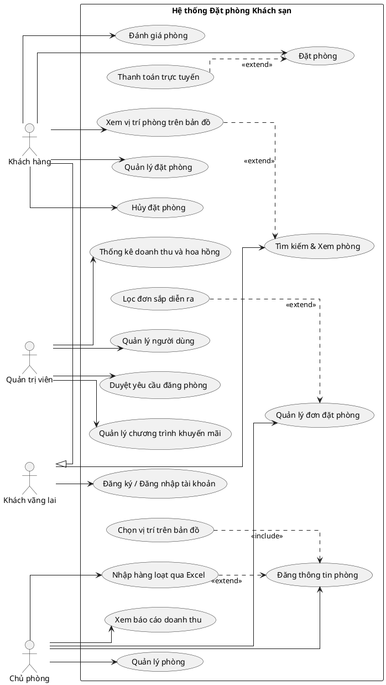

### Biểu đồ Use Case chi tiết cho từng tác nhân (PlantUML)

Để báo cáo chi tiết và dễ theo dõi hơn, dưới đây là các biểu đồ ca sử dụng tách riêng cho từng tác nhân trong hệ thống.

#### 1.1. Tác nhân Khách vãng lai (Guest)
Khách vãng lai là người dùng chưa đăng nhập, chỉ có thể thực hiện tìm kiếm phòng nghỉ và đăng ký/đăng nhập tài khoản.

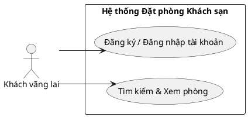

#### 1.2. Tác nhân Khách hàng (Customer)
Khách hàng thừa kế các quyền của Khách vãng lai, đồng thời trực tiếp thực hiện các ca sử dụng giao dịch cốt lõi gồm: Đặt phòng, Quản lý đặt phòng, Hủy đặt phòng, Đánh giá phòng. Ca sử dụng Thanh toán trực tuyến đóng vai trò mở rộng cho Đặt phòng.

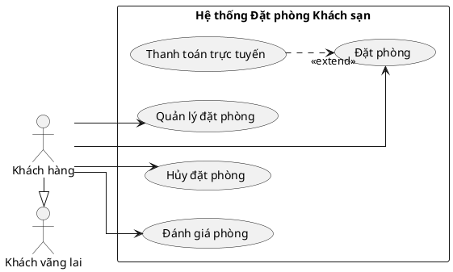

#### 1.3. Tác nhân Chủ phòng (Host)
Chủ phòng trực tiếp thực hiện các ca sử dụng quản trị phòng nghỉ của mình trên hệ thống bao gồm: Đăng thông tin phòng (có chọn vị trí bản đồ), Nhập hàng loạt qua Excel, Quản lý phòng, Quản lý đơn đặt phòng (bao gồm lọc đơn sắp diễn ra), và Xem báo cáo doanh thu.

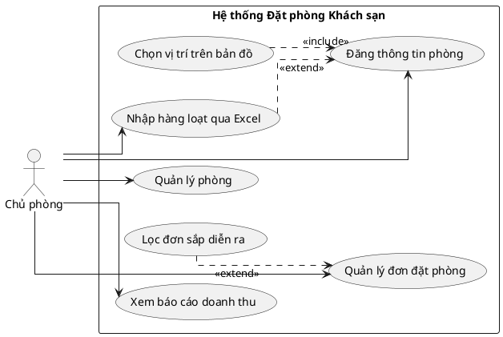

#### 1.4. Tác nhân Quản trị viên (Admin)
Quản trị viên quản lý toàn bộ hệ thống độc lập, chịu trách nhiệm duyệt yêu cầu đăng phòng, quản lý người dùng, quản lý chương trình khuyến mãi, thống kê doanh thu và hoa hồng.

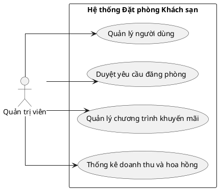

---

## 2. Activity Diagram (Biểu đồ hoạt động nghiệp vụ - 3 Biểu đồ)

Mô tả luồng xử lý các nghiệp vụ cốt lõi của hệ thống dưới góc nhìn các hành động thực tế.

### Biểu đồ 2.1: Nghiệp vụ Đặt phòng & Thanh toán trực tuyến
Mô tả quá trình khách hàng đặt phòng, hệ thống xử lý tính toán chi phí, giữ phòng tạm thời, kết nối cổng thanh toán trực tuyến và ghi nhận giao dịch thành công.

```plantuml
@startuml
start
:Khách chọn phòng & Ngày đặt;
:Hệ thống kiểm tra phòng trống;
if (Phòng trống?) then (đã có khách đặt trùng ngày)
    :Báo lỗi phòng không khả dụng;
    stop
else (phòng còn trống)
    :Tạo yêu cầu đặt phòng (Chờ thanh toán)\n(Tính toán giá gốc, số tiền giảm giá, tổng thanh toán);
    :Hệ thống tạo yêu cầu thanh toán trực tuyến;
    :Thực hiện thanh toán trực tuyến;
    :Khách xác nhận thanh toán;
    if (Thanh toán thành công?) then (Có)
        :Cập nhật đơn đặt phòng sang Đã xác nhận\nGhi nhận thanh toán thành công\nÁp dụng khuyến mãi\nTự động tính hoa hồng dịch vụ & doanh thu thực nhận chủ phòng;
        :Hiển thị thông báo đặt phòng thành công;
    else (Hủy giao dịch hoặc lỗi xác thực)
        :Hủy yêu cầu đặt phòng;
        :Báo lỗi thanh toán thất bại;
    fi
endif
stop
@enduml
```

### Biểu đồ 2.2: Nghiệp vụ Đăng thông tin phòng & Duyệt yêu cầu đăng phòng của Quản trị viên
Chủ phòng gửi đăng ký thông tin phòng mới lên hệ thống. Hệ thống hỗ trợ chọn vị trí trên bản đồ Leaflet; nếu chủ phòng chưa chọn thủ công, hệ thống tự động Geocoding từ địa chỉ nhập vào, kiểm tra trùng tọa độ trong phạm vi 20m cùng chủ trước khi lưu. Sau đó hệ thống chờ kiểm duyệt và hiển thị công khai khi được phê duyệt.

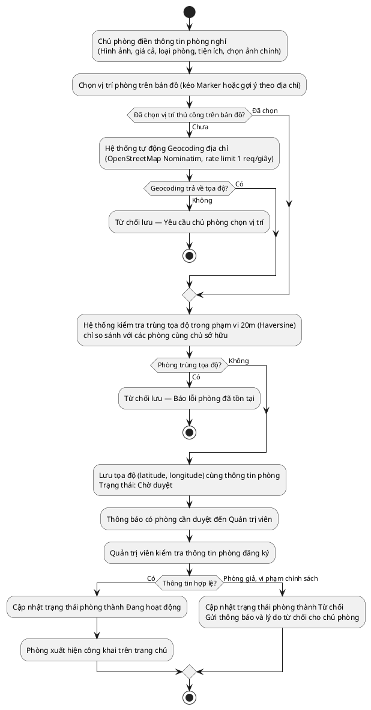

### Biểu đồ 2.3: Nghiệp vụ Hủy đặt phòng & Hoàn tiền
Khách hàng yêu cầu hủy đơn hàng, hệ thống kiểm tra thời gian theo quy định để đưa ra quyết định hoàn trả tiền.

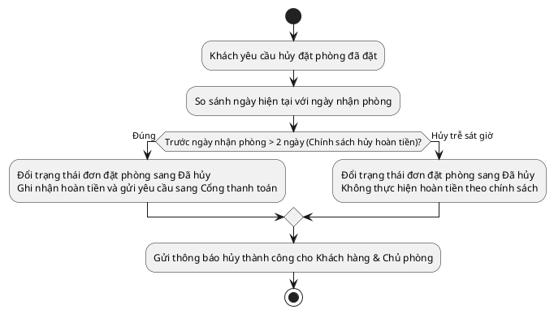

---

## 3. Sequence Diagram (Biểu đồ trình tự nghiệp vụ - 10 Biểu đồ)

Biểu đồ trình tự mô tả cách các tác nhân (Actors) tương tác với Màn hình Giao diện (Boundaries) và các Thực thể nghiệp vụ (Entities) để hoàn tất quy trình hệ thống.

### Biểu đồ 3.1: Xác thực người dùng (Đăng nhập tài khoản)
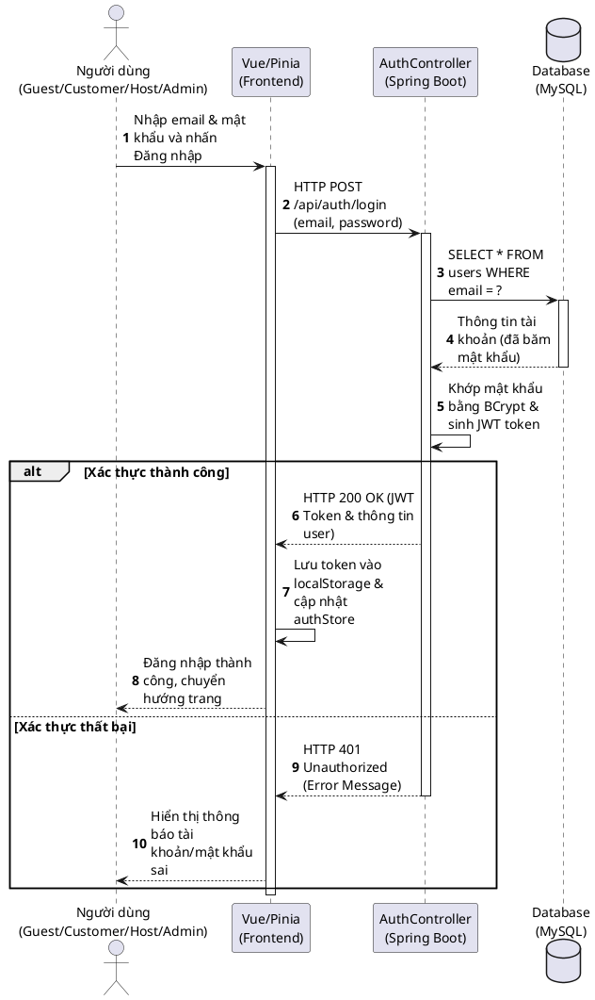

### Biểu đồ 3.2: Đặt phòng và Thanh toán trực tuyến
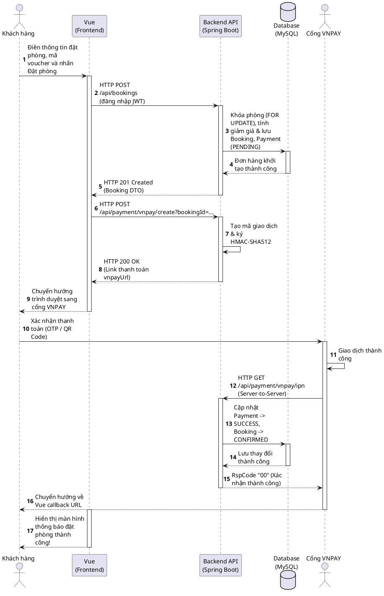

### Biểu đồ 3.3: Chủ phòng cập nhật thông tin phòng nghỉ
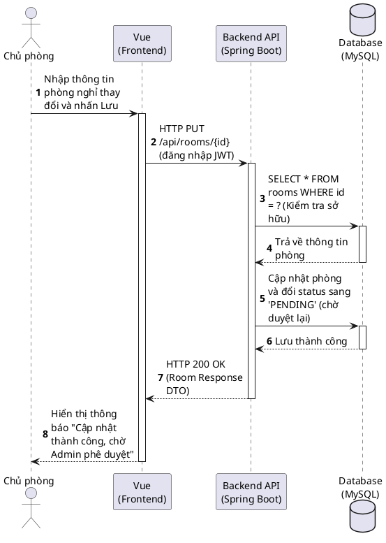

### Biểu đồ 3.4: Quản trị viên duyệt yêu cầu đăng phòng
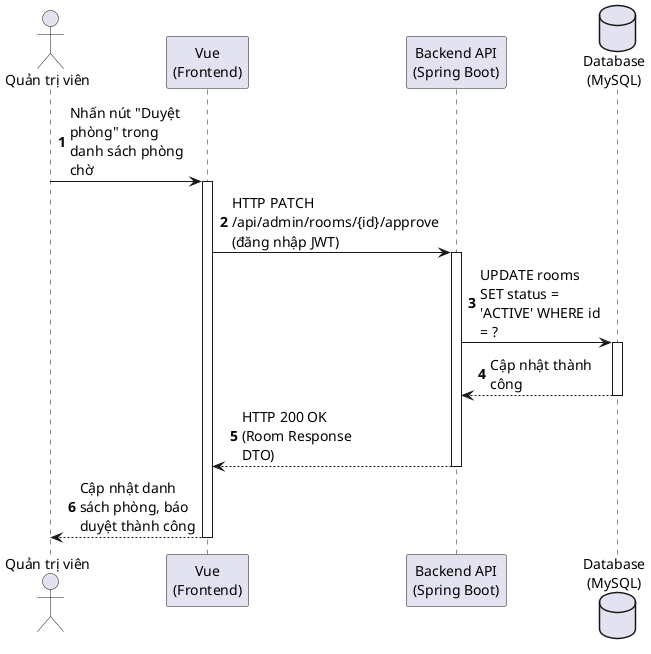

### Biểu đồ 3.5: Xem thống kê & báo cáo doanh thu
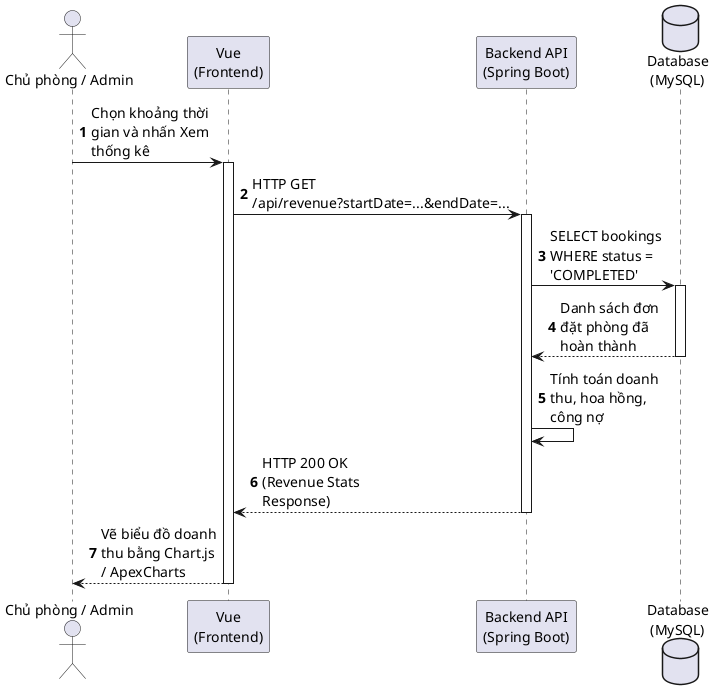

### Biểu đồ 3.6: Tìm kiếm và xem chi tiết phòng nghỉ
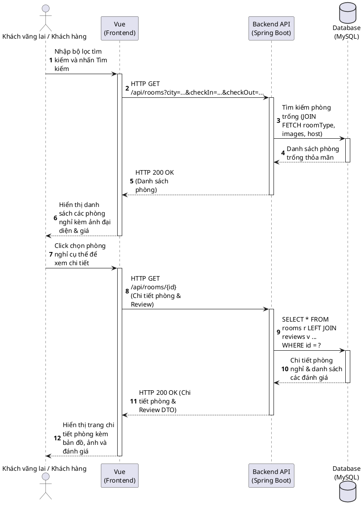

### Biểu đồ 3.7: Hủy đặt phòng
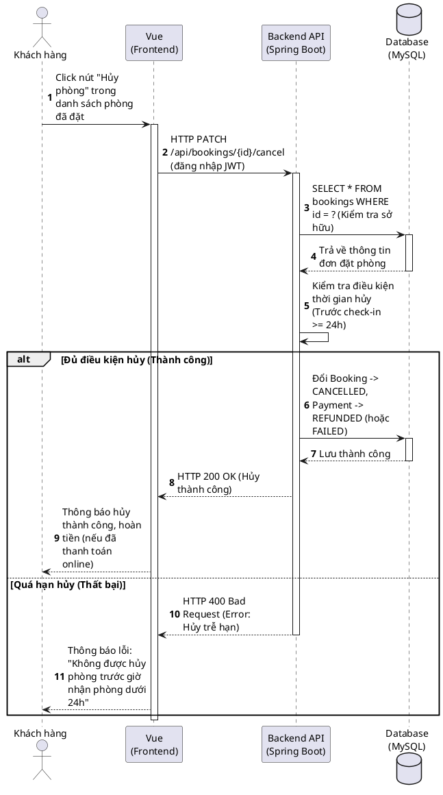

### Biểu đồ 3.8: Đánh giá chất lượng phòng nghỉ
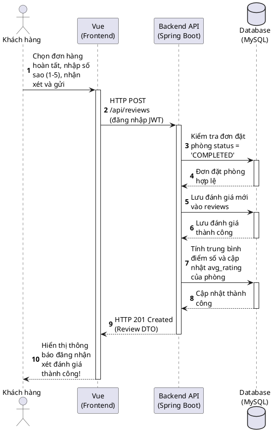

### Biểu đồ 3.9: Chủ phòng đăng phòng mới
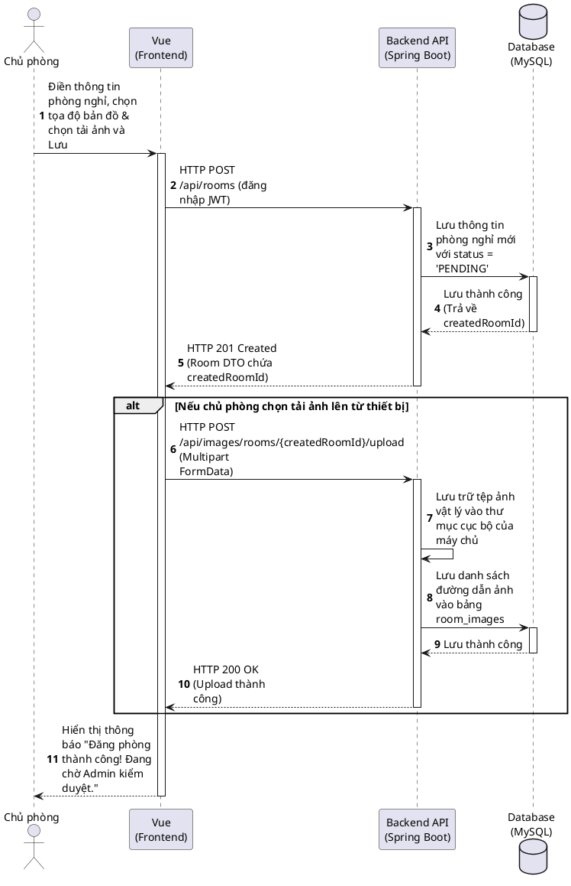

### Biểu đồ 3.11: Chủ phòng nhập hàng loạt phòng từ file Excel
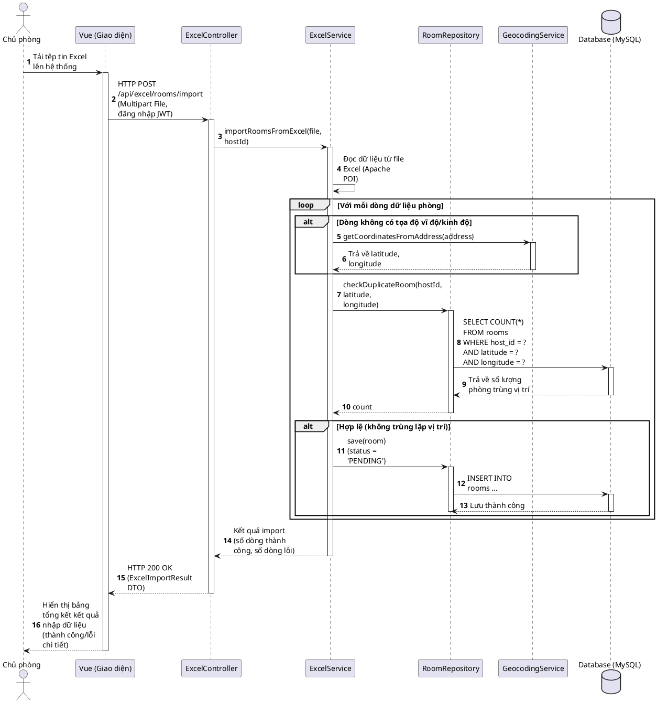

### Biểu đồ 3.10: Quản trị viên quản lý chương trình khuyến mãi
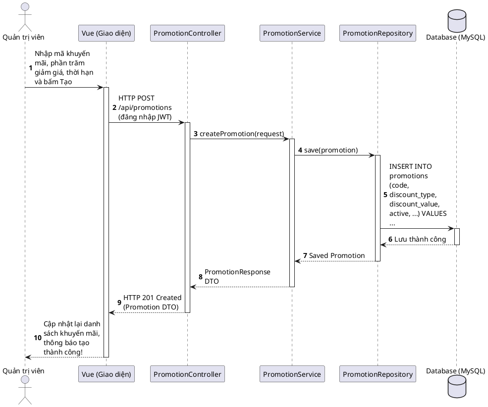

---

## 5. ERD (Entity-Relationship Diagram - Sơ đồ thực tế quan hệ)

Sơ đồ cơ sở dữ liệu mô tả cấu trúc vật lý của các bảng để lưu trữ dữ liệu trong hệ thống, tập trung vào thuộc tính dữ liệu nghiệp vụ và các liên kết khóa ngoại.

### Biểu đồ ERD (PlantUML)

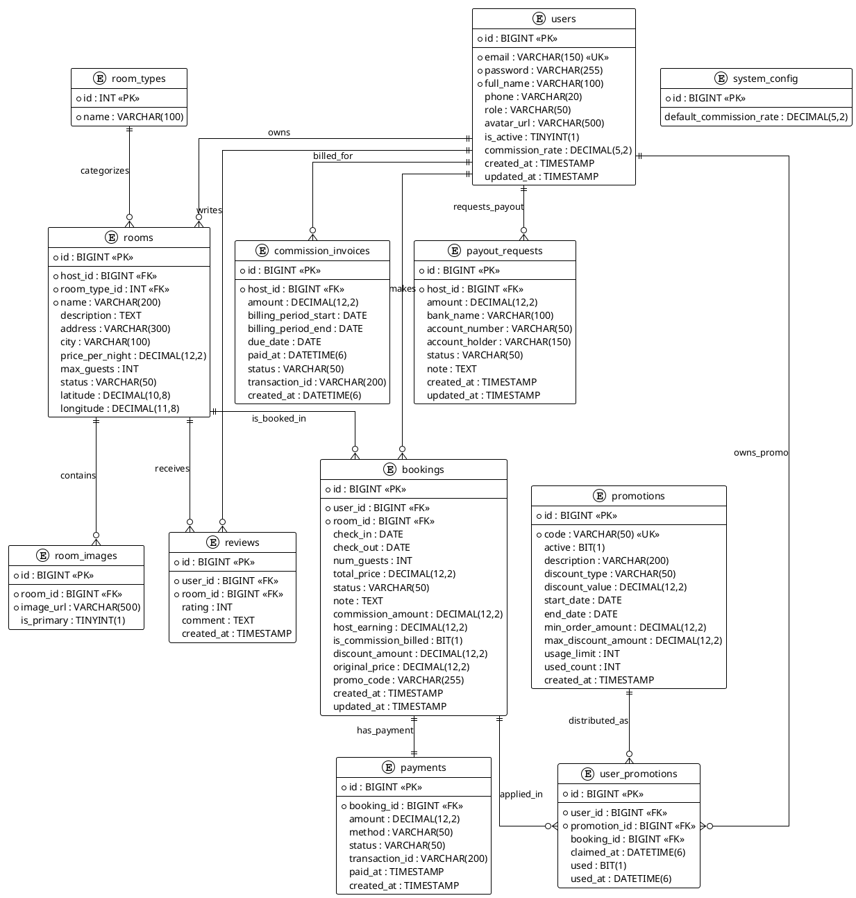

---

## 6. Deployment Diagram (Biểu đồ triển khai logic)

Biểu đồ triển khai mô tả cách phân bổ các thành phần lô-gíc của hệ thống trên môi trường máy chủ và thiết bị người dùng.

### Biểu đồ triển khai (PlantUML)

```plantuml
@startuml
skinparam linetype ortho

node "Thiết bị người dùng (Client Node)" {
    node "Trình duyệt Web (Browser)" {
        component "Ứng dụng Giao diện (Client Application)" as ClientApp
    }
}

node "Máy chủ ứng dụng (Application Server)" {
    component "Bộ phận định tuyến và bảo mật (Web/Proxy Server)" as WebServer
    node "Môi trường thực thi ứng dụng" {
        component "Bộ xử lý Nghiệp vụ hệ thống (Backend Logic)" as BackendService
    }
}

node "Máy chủ Cơ sở dữ liệu (Database Server)" {
    database "Hệ quản trị Cơ sở dữ liệu quan hệ" {
        component "Cơ sở dữ liệu Đặt phòng khách sạn" as DB
    }
}

node "Hệ thống dịch vụ bên ngoài" {
    component "Cổng thanh toán trực tuyến" as PaymentGateway
}

ClientApp --> WebServer : Kết nối qua Giao thức mạng an toàn (Secure Network Connection)
ClientApp --> PaymentGateway : Chuyển hướng giao dịch thanh toán
WebServer --> BackendService : Chuyển tiếp yêu cầu xử lý
BackendService --> DB : Truy xuất và cập nhật dữ liệu
BackendService --> PaymentGateway : Đối chiếu kết quả giao dịch
@enduml
```

---

## 7. Architecture Diagram (Sơ đồ kiến trúc logic phân tầng)

Sơ đồ thể hiện sự phân chia các lớp kiến trúc logic đảm nhận các vai trò khác nhau trong hệ thống (Layered Architecture).

### Biểu đồ kiến trúc (PlantUML)

```plantuml
@startuml
skinparam linetype ortho

package "Tầng Giao diện người dùng (Presentation Layer)" {
    [Thành phần hiển thị giao diện] as UI
    [Quản lý trạng thái dữ liệu giao diện] as State
    [Điều hướng màn hình] as Nav
    [Thành phần gửi yêu cầu hệ thống] as Client
    
    UI --> State
    UI --> Nav
    UI --> Client
}

package "Tầng Kiểm soát bảo mật (Security Layer)" {
    [Kiểm soát quyền truy cập] as Cors
    [Xác thực thông tin người dùng] as Auth
}

package "Tầng Xử lý Nghiệp vụ (Business Logic Layer)" {
    [Điều phối yêu cầu] as Coordinator
    [Chuyển đổi dữ liệu nghiệp vụ] as DTO
    [Xử lý nghiệp vụ lõi] as CoreBusiness
    [Thành phần truy xuất dữ liệu] as DataAccess
    
    Coordinator --> DTO
    Coordinator --> CoreBusiness
    CoreBusiness --> DataAccess
}

database "Tầng Lưu trữ Dữ liệu" {
    [Cơ sở dữ liệu hệ thống] as SystemDB
}

Client --> Cors : 1. Gửi yêu cầu dịch vụ
Cors --> Auth
Auth --> Coordinator : 2. Chuyển tiếp yêu cầu đã xác thực
DataAccess --> SystemDB : 3. Truy vấn dữ liệu lưu trữ
SystemDB --> DataAccess : 4. Trả về kết quả truy vấn
DataAccess --> CoreBusiness
CoreBusiness --> Coordinator
Coordinator --> Client : 5. Trả về kết quả xử lý nghiệp vụ
@enduml
```

---

## 8. Flowchart các chức năng chính (Sơ đồ luồng)

Mô tả luồng người dùng di chuyển từ trang chủ tìm kiếm đến khi hoàn tất thanh toán phòng nghỉ.

### Sơ đồ luồng (PlantUML)

```plantuml
@startuml
' Cấu hình giao diện đen trắng (monochrome), không đổ bóng
skinparam monochrome true
skinparam shadowing false
skinparam defaultFontName "Arial"
skinparam defaultFontSize 12

skinparam activity {
  BackgroundColor White
  BorderColor Black
  ArrowColor Black
}

|Khách hàng|
start
:Truy cập Trang chủ;
:Nhập địa điểm, ngày nhận/trả phòng, số khách;
:Nhấn Tìm kiếm;
repeat
  :Hiển thị danh sách phòng phù hợp;
  backward:Áp dụng bộ lọc\n(giá, tiện nghi, loại phòng);
repeat while (Có lọc thêm?) is (Có) not (Không)

:Chọn phòng, xem chi tiết và đánh giá;

if (Nhấn Đặt phòng?) then (Có)
  if (Đã đăng nhập?) then (Chưa)
    :Chuyển hướng trang Đăng nhập / Đăng ký\n(Sau khi đăng nhập xong quay lại);
  else (Đã đăng nhập)
  endif
  
  :Điền ghi chú, áp dụng mã khuyến mãi (nếu có);
  :Chọn phương thức thanh toán;
  
  |Hệ thống|
  :Hệ thống tạo đơn đặt phòng\n(trạng thái PENDING);
  :Chuyển hướng sang\ncổng thanh toán VNPAY;
  
  |Cổng thanh toán VNPAY|
  if (Thanh toán thành công?) then (Có)
    |Hệ thống|
    :Cập nhật đơn đặt phòng sang CONFIRMED,\nghi nhận thanh toán thành công;
    :Gửi thông báo cho Chủ phòng và Khách hàng;
    
    |Khách hàng|
    :Kết thúc\n(Đặt phòng thành công);
    stop
  else (Không)
    |Hệ thống|
    :Báo lỗi thanh toán,\ngiữ nguyên trạng thái PENDING;
    
    |Khách hàng|
    :Kết thúc\n(Hủy xem phòng);
    stop
  endif
else (Không)
  |Khách hàng|
  :Kết thúc\n(Hủy xem phòng);
  stop
endif
@enduml
```

---

## 9. Biểu đồ thống kê kết quả trong báo cáo (Charts - PlantUML)

Dưới đây là các biểu đồ thống kê kết quả mô tả dưới dạng thiết kế PlantUML Salt để mô phỏng hiển thị trên báo cáo hoặc giao diện.

### 9.1. Biểu đồ 1: Thống kê doanh thu & Thực nhận Host 12 tháng (Năm 2026)
```plantuml
@startsalt
{
  Thống kê doanh thu & Thực nhận theo tháng năm 2026 (Triệu VNĐ)
  --
  Tháng | Tổng doanh thu khách trả | Thực nhận Host (đã trừ 10% phí)
  Tháng 1  | 120 Triệu | 108 Triệu
  Tháng 2  | 115 Triệu | 103 Triệu
  Tháng 3  | 130 Triệu | 117 Triệu
  Tháng 4  |  95 Triệu |  85 Triệu
  Tháng 5  | 140 Triệu | 126 Triệu
  Tháng 6  | 110 Triệu |  99 Triệu
  Tháng 7  |  85 Triệu |  76 Triệu
  Tháng 8  | 125 Triệu | 112 Triệu
  Tháng 9  | 100 Triệu |  90 Triệu
  Tháng 10 | 135 Triệu | 121 Triệu
  Tháng 11 | 145 Triệu | 130 Triệu
  Tháng 12 | 150 Triệu | 135 Triệu
}
@endsalt
```

### 9.2. Biểu đồ 2: Tỷ lệ trạng thái đơn đặt phòng
```plantuml
@startsalt
{
  Tỷ lệ đơn đặt phòng theo trạng thái
  --
  * CONFIRMED / COMPLETED (Thành công) | [====================] 72%
  * CANCELLED (Khách hủy)             | [=====] 20%
  * PENDING (Chờ thanh toán)          | [==] 8%
}
@endsalt
```

### 9.3. Biểu đồ 3: Top 5 phòng có doanh thu cao nhất
```plantuml
@startsalt
{
  Top 5 phòng nghỉ có doanh thu cao nhất năm 2026
  --
  1. Presidential Suite | [========================] 240 Triệu VNĐ
  2. Deluxe Ocean View  | [==================] 185 Triệu VNĐ
  3. Executive Suite    | [===============] 150 Triệu VNĐ
  4. Family Bungalow    | [============] 120 Triệu VNĐ
  5. Superior Garden    | [=========] 95 Triệu VNĐ
}
@endsalt
```

### 9.4. Biểu đồ 4: Tỷ lệ phòng có cập nhật vị trí GPS
```plantuml
@startsalt
{
  Tỷ lệ phòng có tọa độ GPS được cập nhật
  --
  * Có vị trí (locationAvailable = true)  | [================] 65%
  * Chưa có vị trí (chờ host cập nhật)   | [========] 35%
}
@endsalt
```

### 9.5. Biểu đồ 5: Phương thức Import phòng của Host
```plantuml
@startsalt
{
  Tỷ lệ phương thức đăng phòng của Chủ phòng
  --
  * Đăng thủ công qua Form     | [==================] 74%
  * Nhập hàng loạt qua Excel  | [======] 26%
}
@endsalt
```

---

## HƯỚNG DẪN CÁCH VẼ LÊN WORD / DRAW.IO / SLIDE
1. **Để xuất ảnh sơ đồ nhanh**: Bạn hãy truy cập vào trang [PlantText UML Editor](https://www.planttext.com/) hoặc [PlantUML Live Editor](http://www.plantuml.com/plantuml), sao chép mã PlantUML ở các mục trên dán vào khung soạn thảo. Trang web sẽ tự động render ra hình ảnh cực kỳ sắc nét để bạn có thể tải về dạng PNG/SVG chèn vào báo cáo.
2. **Để vẽ tùy chỉnh trên Draw.io**: 
   - Mở [Draw.io](https://app.diagrams.net/).
   - Bạn có thể chọn menu `Arrange` -> `Insert` -> `Advanced` -> `PlantUML...` và dán mã nguồn PlantUML ở trên để draw.io tự vẽ sơ đồ thành các khối có thể chỉnh sửa thủ công.
3. **Thư viện đề xuất trên Vue.js 3**: Nếu giảng viên yêu cầu hiển thị biểu đồ thống kê trực tiếp trên giao diện Admin/Host, hãy cài đặt và sử dụng thư viện **ApexCharts** (`vue3-apexcharts`) or **Chart.js** (`vue-chartjs`). Chúng rất dễ bind data từ API JSON trả về từ Controller.
