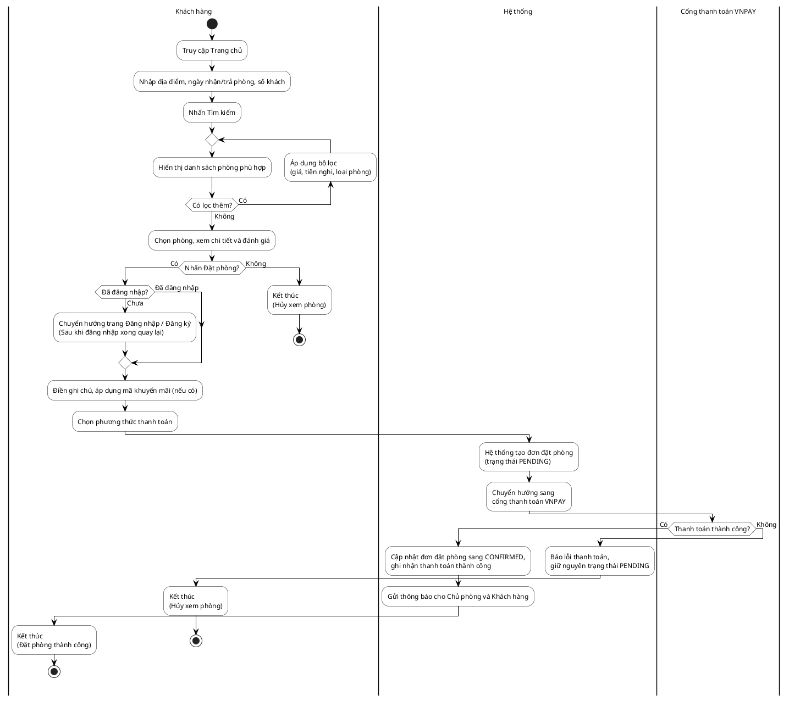

# Sơ đồ Quy trình Đặt phòng (Hotel Booking Flow) - Trắng đen & Rõ ràng

Tài liệu này chứa sơ đồ quy trình đặt phòng khách sạn (được vẽ lại rõ ràng, không sử dụng màu sắc theo yêu cầu) dưới hai định dạng phổ biến: **Mermaid** (có thể xem trực tiếp trên GitHub/VS Code) và mã **PlantUML** (để copy vào tài liệu báo cáo của bạn).

---

## 1. Sơ đồ Quy trình (Định dạng Mermaid)

```mermaid
%%{init: {
  'theme': 'neutral',
  'themeVariables': {
    'primaryColor': '#ffffff',
    'edgeLabelBackground': '#ffffff',
    'tertiaryColor': '#ffffff',
    'lineColor': '#000000',
    'textColor': '#000000',
    'mainBkg': '#ffffff',
    'nodeBorder': '#000000',
    'actorBorder': '#000000'
  }
}}%%
flowchart TD
    %% Định nghĩa các node
    Start([Bắt đầu])
    GoHome[Truy cập Trang chủ]
    InputInfo[Nhập địa điểm, ngày nhận/trả phòng, số khách]
    ClickSearch[Nhấn Tìm kiếm]
    ShowRooms[Hiển thị danh sách phòng phù hợp]
    ApplyFilter[Áp dụng bộ lọc\ngiá, tiện nghi, loại phòng]
    SelectRoom[Chọn phòng, xem chi tiết và đánh giá]
    
    ClickBook{Nhấn Đặt phòng?}
    IsLoggedIn{Đã đăng nhập?}
    
    RedirectLogin[Chuyển hướng trang\nĐăng nhập / Đăng ký]
    FillInfo[Điền ghi chú, áp dụng\nmã khuyến mãi nếu có]
    SelectPayment[Chọn phương thức thanh toán]
    CreateBooking[Hệ thống tạo đơn đặt phòng\ntrạng thái PENDING]
    RedirectVNPAY[Chuyển hướng sang\ncổng thanh toán VNPAY]
    
    PaySuccess{Thanh toán thành công?}
    PayError[Báo lỗi thanh toán,\ngiữ nguyên trạng thái PENDING]
    ConfirmBooking[Cập nhật đơn đặt phòng\nsang CONFIRMED,\nghi nhận thanh toán thành công]
    SendNotification[Gửi thông báo cho\nChủ phòng và Khách hàng]
    
    EndCancel([Kết thúc\nHủy xem phòng])
    EndSuccess([Kết thúc\nĐặt phòng thành công])

    %% Định nghĩa các kết nối
    Start --> GoHome
    GoHome --> InputInfo
    InputInfo --> ClickSearch
    ClickSearch --> ShowRooms
    
    ShowRooms -- Có lọc thêm --> ApplyFilter
    ApplyFilter --> ShowRooms
    
    ShowRooms --> SelectRoom
    SelectRoom --> ClickBook
    
    ClickBook -- Không --> EndCancel
    ClickBook -- Có --> IsLoggedIn
    
    IsLoggedIn -- Chưa --> RedirectLogin
    RedirectLogin -- Sau khi đăng nhập --> FillInfo
    
    IsLoggedIn -- Đã đăng nhập --> FillInfo
    
    FillInfo --> SelectPayment
    SelectPayment --> CreateBooking
    CreateBooking --> RedirectVNPAY
    RedirectVNPAY --> PaySuccess
    
    PaySuccess -- Không --> PayError
    PayError --> EndCancel
    
    PaySuccess -- Có --> ConfirmBooking
    ConfirmBooking --> SendNotification
    SendNotification --> EndSuccess

    %% Định dạng CSS bổ sung để đảm bảo hiển thị đen trắng sắc nét
    classDef mono fill:#ffffff,stroke:#000000,stroke-width:2px,color:#000000;
    classDef startEnd fill:#ffffff,stroke:#000000,stroke-width:3px,color:#000000;
    
    class GoHome,InputInfo,ClickSearch,ShowRooms,ApplyFilter,SelectRoom,RedirectLogin,FillInfo,SelectPayment,CreateBooking,RedirectVNPAY,PayError,ConfirmBooking,SendNotification mono;
    class Start,EndCancel,EndSuccess startEnd;
```

---

## 2. Mã nguồn Sơ đồ (Định dạng PlantUML)

Bạn có thể copy mã nguồn dưới đây và dán vào [PlantText](https://www.planttext.com/) hoặc extension PlantUML trong VS Code để xuất ra hình ảnh chất lượng cao:

---

## 3. Giải thích các bước trong quy trình

1. **Khởi đầu (Bắt đầu):** Người dùng truy cập vào trang chủ của hệ thống.
2. **Tìm kiếm phòng:** Người dùng nhập các tiêu chí tìm kiếm bao gồm:
   - Địa điểm mong muốn
   - Ngày nhận phòng (check-in) và ngày trả phòng (check-out)
   - Số lượng khách đi cùng
   - Nhấn nút **Tìm kiếm** để hệ thống hiển thị danh sách phòng trống phù hợp.
3. **Bộ lọc nâng cao:** Từ danh sách phòng, người dùng có thể áp dụng các bộ lọc như mức giá, các tiện nghi cần thiết, hoặc loại phòng để thu hẹp phạm vi hiển thị.
4. **Xem thông tin chi tiết:** Người dùng chọn phòng cụ thể để xem thông tin chi tiết, hình ảnh, dịch vụ đi kèm và các đánh giá từ những khách hàng trước.
5. **Yêu cầu Đặt phòng:** Khi nhấn nút **Đặt phòng**, hệ thống kiểm tra trạng thái đăng nhập:
   - *Nếu chưa đăng nhập:* Chuyển hướng người dùng qua trang Đăng nhập hoặc Đăng ký. Sau khi hoàn thành, quay trở lại luồng đặt phòng.
   - *Nếu đã đăng nhập:* Cho phép điền các thông tin bổ sung.
6. **Nhập thông tin thanh toán:** Người dùng điền ghi chú đặc biệt cho chủ phòng, nhập mã giảm giá (voucher) nếu có và lựa chọn phương thức thanh toán.
7. **Khởi tạo đơn đặt (PENDING):** Hệ thống tạo một bản ghi đơn đặt phòng mới trong cơ sở dữ liệu với trạng thái mặc định là **PENDING** (Chờ thanh toán) để tạm giữ phòng.
8. **Thanh toán qua cổng VNPAY:** Hệ thống chuyển hướng người dùng sang trang thanh toán của cổng VNPAY.
9. **Kết quả thanh toán:**
   - *Thanh toán thất bại hoặc hủy giao dịch:* Hệ thống hiển thị thông báo lỗi thanh toán, đơn đặt phòng vẫn được giữ nguyên ở trạng thái **PENDING** (và sẽ bị tự động hủy sau một thời gian bởi hệ thống quét ngầm). Người dùng kết thúc luồng.
   - *Thanh toán thành công:* Hệ thống cập nhật trạng thái đơn đặt phòng sang **CONFIRMED** (Đã xác nhận) và ghi nhận thanh toán thành công.
10. **Thông báo & Kết thúc:** Hệ thống gửi thông báo xác nhận thành công đến cả Khách hàng và Chủ phòng (qua email/hệ thống thông báo) và kết thúc quy trình đặt phòng thành công.
